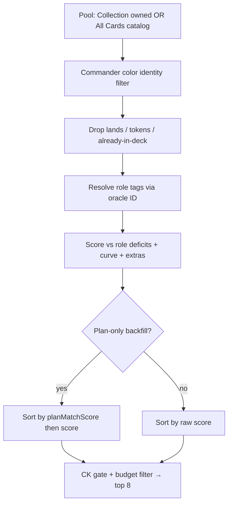

# Suggested Adds — Improvement Plan (Entry 13 v2 + scoring/UX)

**Status:** Design (ready to draft implementation prompts)  
**Date:** 2026-07-18  
**Audience:** Product + implementer agents  
**Hard constraint:** Deterministic algorithm only — no runtime AI/LLM.

This document explains **how Suggested Adds works today**, why it feels wrong
(plan ignored, opaque picks, scores stuck ≤7/10), and a **phased fix plan**.
Implementation should be split into Ready Prompts after the locked decisions below
are accepted (or explicitly overridden).

Related code:
- `js/adds-scoring.js` — formula `(D × M) + C_eff + L + E + B − P + V + T + K`
- `js/decks.js` — `_computeAddContext`, `_scoreAddCandidate`, `_renderAddSuggestions`
- `js/deck-plan.js` — plan schema, `planMatchScore`, Plan-only backfill gate
- `js/deck-plan-wizard.js` — Entry 13 v1 wizard UI
- Prior branches (not all on Manford): `adds-absolute-display-ac44`,
  `adds-min-score-kb-ac44`, `adds-require-role-tag-7d8f`, `adds-score-display-scale-db9e`

---

## 1. How cards are identified today (the opaque part)

Suggested Adds does **not** “understand” the deck narratively. It ranks a pool of
printings with a deterministic checklist:



### 1.1 Role tags = identity

A card is “identified” as useful when it has **utility role tags** (Ramp, Removal,
Sac Outlet, …). Tags come from:

1. Scryfall auto-tags keyed by **oracle ID** (`_roleTagsForCard` / `_scryTagsByOracleId`)
2. User custom tags + tag overrides
3. Server `roleTags` on collection rows as a cache fallback (`_probTagsOnCard`)

If a card has no utility tags, v1 still allows a weak **Plan** path (untagged =
“theme/identity” filler when the Plan count is under target). A later branch
(`adds-require-role-tag`) drops roleless candidates entirely — decide whether that
ships with Phase A.

### 1.2 Deficits = what the deck “needs”

`_computeAddContext` counts tags in the deck and compares them to the **recipe
thresholds** (shared with Suggested Cuts):

| Role (default) | Target |
|----------------|-------:|
| Ramp / Card Draw / Removal | 10 |
| Plan (untagged non-lands) | 30 |
| Board Wipe / Counterspell / Protection / Recursion | 3 |
| Tutor | 2 |

Archetype + Aggro↔Control slider nudge those targets.  
**Deficit** = `max(0, target − have)`.

### 1.3 Score terms (what the badge is made of)

| Term | Meaning |
|------|---------|
| **D** | How large a hole the card’s tags fill (sublinear if multi-tag) |
| **M** | Conditional-keyword gate (×&lt;1 if “whenever you cast X” and deck lacks X) |
| **C_eff / L** | Curve gap vs efficient-CMC for interaction roles |
| **E** | EDHREC role percentile (+ small price band) |
| **B** | Creature-body bonus when filling a real deficit |
| **P** | Colored-pip tax |
| **V / T / K** | Versatility / tribal / commander cast-theme |

**Important:** Declared deck plan is **not** in this formula today.

### 1.4 Where the plan *does* matter (narrow)

Only when **Plan is the largest active deficit** and the wizard plan is declared
(`winConditionId` + `primaryStrategyId`):

1. Unowned Plan-theme fetch may run (`shouldFetchPlanOnlyBackfill`)
2. Candidates are sorted by `planMatchScore` (strategy/wincon tag+oracle match), then score

If the deck still needs Ramp/Draw/Removal, those deficits dominate and the plan is
effectively ignored for ranking. That is the main “it doesn’t understand my plan”
bug.

---

## 2. Why nothing feels above 7/10

Two separate systems got mixed in recent agent work:

### 2.1 Absolute badge scale (UI)

Branches introduced:

```text
display = min(10, raw / ADD_SCORE_RAW_CEILING * 10)
```

Examples of ceilings used historically: **12**, then **8** (after `K_E` retunes).

With `CEILING = 8`:

| Raw score | Badge |
|----------:|------:|
| 4.0 | 5.0/10 |
| 5.6 | **7.0/10** |
| 6.4 | 8.0/10 |
| ≥8.0 | 10/10 |

A typical “fills a 3-card Ramp hole + creature + mild EDHREC” candidate lands
around raw **4–6** → badge **5–7.5/10**. Hitting **9–10/10** needs a large D,
commander-theme bonus (`K = 2`), multi-deficit, or a high E after weight retunes.
So “nothing above 7/10” is often **calibration**, not “no good cards exist.”

### 2.2 Optional ≥7/10 floor (filter)

`adds-min-score-kb-ac44` adds `ADD_SCORE_DISPLAY_MIN = 7` and hides anything below.
Combined with a tight ceiling, Collection mode can look empty or only show ~7.0
picks — which reads as “broken” rather than “strict quality bar.”

### 2.3 Manford vs display branches

Current Manford tip still shows **raw** scores (`4.5`), not `N/10`. If the user
sees `/10`, they are on a build that includes the absolute-display PRs. The plan
below assumes we **keep** absolute `/10` badges and fix the calibration + plan
term so 8–10 become achievable for true on-plan staples.

---

## 3. Goals

1. **Plan-aware ranking** — declared strategy/wincon changes *which* cards win,
   not only Plan-only backfill sort order.
2. **Legible identity** — user can see *why this card was considered* (tags,
   deficits, plan match) without reading the formula.
3. **Honest 0–10 badges** — 10 = top-tier fit for *this* deck; strong on-plan
   staples routinely reach 8–10; weak fillers stay ≤5.
4. **No runtime AI** — tables, tags, formulas only.

---

## 4. Locked design decisions (propose; confirm before coding)

| # | Decision | Proposal |
|---|----------|----------|
| D1 | Badge style | **Absolute** `/10` (not list-relative). 10 = raw ≥ ceiling. |
| D2 | Ceiling | Recalibrate after adding plan term **H**. Start `ADD_SCORE_RAW_CEILING = 10` once H ships; re-vignette with Three Visits / on-plan staple / off-plan staple. |
| D3 | Display floor | **No hard hide** at 7/10. Optional soft UI hint (“weak fit”) below 5/10. Do not empty the list. |
| D4 | Plan in score | New term **H** (hybrid/plan fit) added to ranking formula when plan declared. |
| D5 | H formula | `H = K_H × planMatchNormalized` with `planMatchNormalized = planMatchScore / 4` (max primary+secondary+wincon = 4). Locked `K_H = 2.0` (same order as commander theme K). |
| D6 | Hybrid role modifiers | When plan declared, multiply matched **D** deficits for plan-aligned roles by `1 + α` and off-plan utility deficits by `1 − β` (defaults `α=0.35`, `β=0.15`, clamp multipliers to `[0.5, 1.75]`). Persist in `deck.plan.hybridRoleModifiers` (schema hook already exists). |
| D7 | Plan-aligned roles | Union of `PLAN_STRATEGY_PROJECT_TAGS[primary|secondary]` ∪ `PLAN_WINCON_PROJECT_TAGS[wincon]`. |
| D8 | When no plan | H = 0; hybrid multipliers off; behavior = today’s deficit recipe (v1). |
| D9 | Roleless candidates | Require ≥1 utility role tag for suggestions (land/commander don’t count). Plan deficit still counted for deck health, but Adds won’t recommend untagged blanks. |
| D10 | Cuts plan shielding | **Phase B** — do not block Phase A Adds work. |
| D11 | Wizard v2 extras | Tertiary strategy, free-text notes, beginner copy — **Phase B/C**; not required for H. |
| D12 | EDHREC weight | Keep Manford’s current `K_E` / `K_L` / `K_B` unless vignettes prove E still swamps D; retune only with logged soft vignettes. |

---

## 5. Phase A — Make Adds respect the plan + fix the badge (implement next)

**Outcome:** On-plan cards outrank off-plan role-fillers; badges can reach 9–10;
Why panel explains identity.

### A1. Score term H + hybrid D modifiers

Files: `js/adds-scoring.js`, `js/deck-plan.js`, `js/decks.js`

1. Compute `planFit` from existing `planMatchScore` (0–4 → 0–1).
2. Apply D1–D8: `score += H`; scale matched deficit rows that are plan-aligned /
   off-plan per D6 **before** sublinear weights (document order in PR).
3. Wire `_scoreAddCandidate` to pass `deckPlan` into term scoring always (not only
   Plan-only backfill).
4. Surface H in `_buildAddWhyLines` (“Matches your Sacrifice plan”, etc.).

### A2. Absolute display recalibration

1. Land `addDisplayScore` / `formatAddDisplayScore` on Manford if missing.
2. Set ceiling per D2; **no** `ADD_SCORE_DISPLAY_MIN` hard filter.
3. Badge copy: `7.5/10` with tooltip “Absolute fit for this deck (not rank in list).”

### A3. Identity UX (light)

In Why suggested footer / new first line:

- `Identified as: Ramp, Sac Outlet` (utility tags used for scoring)
- `Fills: Ramp (have 6 / want 10)`
- `Plan fit: Sacrifice + Life drain` when H &gt; 0

Optional one-line legend under the panel header explaining pool mode + plan status
(already partly present via plan banner).

### A4. Role-tag gate

Port `adds-require-role-tag` behavior (D9) with tests.

### A5. Verification (hard)

| # | Case | Expect |
|---|------|--------|
| 1 | Declared sacrifice + life drain; candidate Sac Outlet vs generic Ramp when both deficits exist | Sac Outlet ranks above equal-D Ramp unless Ramp hole is much larger (document threshold) |
| 2 | No plan declared | Rank order matches pre-H baseline on fixtures |
| 3 | On-plan staple with D≥3 and H&gt;0 | Badge ≥ 8.0/10 with ceiling=10 |
| 4 | Off-plan weak filler D≤1, H=0 | Badge ≤ 5.0/10 |
| 5 | Why panel lists tags + plan fit text | Present for plan-declared decks |
| 6 | Roleless card | Never appears in top picks |

Soft vignettes (log only): Three Visits vs Growth Spiral; on-plan aristocrat piece
vs random efficient removal.

---

## 6. Phase B — Wizard v2 + Cuts plan (after A)

Entry 13 v2 scope from the Ready Prompts “design only” row:

| Item | Notes |
|------|-------|
| Hybrid modifiers UI | Let advanced users nudge α/β or pick “lean into plan” vs “fill staples first” presets that write `hybridRoleModifiers` |
| Cuts shielding | `cutsShielding`: on-plan tagged cards get cut discount (mirror Adds H) |
| Tertiary strategy | Optional third ID; weight 0.5× in `planMatchScore` |
| Wizard copy tiers | Beginner / Intermediate labels only — same IDs |
| Free-text plan notes | Stored, **not** parsed into score (display + future) |
| Stronger inference chips | Expand Path B signal tables; still ≥0.35 confidence gate |

Do **not** start B until A’s H term is stable.

---

## 7. Phase C — Pool & discovery quality (optional parallel after A1)

- Ensure All Cards catalog rows always carry role tags used for scoring (avoid
  roleless false negatives).
- Plan-aware backfill: when plan declared, allow a **mixed** unowned fetch even if
  Plan is not the largest deficit — e.g. fetch plan-aligned tags for the top 2
  deficits, not only Plan-only.
- EDHREC percentile coverage monitoring (already partially instrumented on prior
  branches).

---

## 8. What we will not do

- Runtime LLM “explain my deck” or embedding similarity
- List-relative badges that force #1 → 10/10 (hides bad pools)
- Hard ≥7/10 filter that blanks Collection
- Rewriting Cuts scoring inside Phase A
- Live Scryfall/EDHREC scrape at suggestion time

---

## 9. Implementation order (Ready Prompts to draft)

| Order | Prompt | Depends on |
|------:|--------|------------|
| **A** | Adds plan term H + hybrid D modifiers + Why lines | Prompt 2 (v1) shipped |
| **A′** | Absolute `/10` badge recalibration (no min floor) | May merge with A |
| **A″** | Require utility role tag | May merge with A |
| **B** | Entry 13 v2 wizard + `hybridRoleModifiers` presets + Cuts shielding | A |
| **C** | Mixed plan-aware backfill beyond Plan-only gate | A |

Update `cuts-adds-ready-prompts.md` when A is accepted: move “13 v2” from
“Design only” to a drafted Prompt with Status Ready/In progress.

---

## 10. Open questions for the user

1. **Badge floor:** Confirm soft hint only (no hide below 7/10)?  
2. **How hard to lean on plan:** Is `K_H = 2.0` + `α=0.35` enough, or should plan
   sometimes beat a larger off-plan Ramp hole?  
3. **Roleless Plan fillers:** Drop entirely (D9) or keep for under-built themes?  
4. **Mixed backfill (Phase C):** Want unowned on-plan tutors/engines even while
   Ramp/Draw deficits exist?

---

## 11. Immediate reading list for the implementer

1. `js/adds-scoring.js` — `scoreAddCandidateTerms`, `computeDeficitTermD`  
2. `js/decks.js` — `_renderAddSuggestions` (~7032), `_buildAddWhyLines`  
3. `js/deck-plan.js` — `planMatchScore`, `PLAN_*_PROJECT_TAGS`, `shouldFetchPlanOnlyBackfill`  
4. Ready Prompt 2 (Entry 13 v1) — out-of-scope list that this plan promotes to v2  
5. Soft vignettes in `scripts/test-adds-scoring.js`
