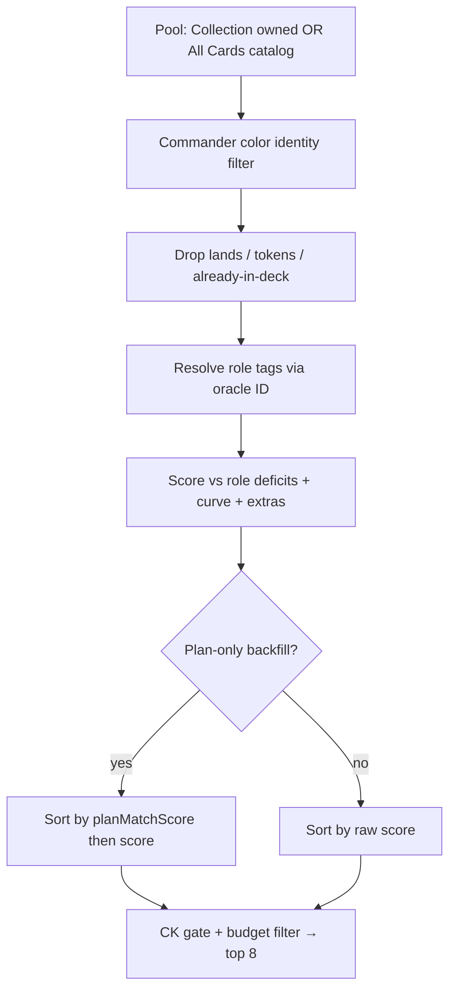

# Suggested Adds — Improvement Plan (Entry 13 v2 + scoring/UX)

**Status:** Design (planning — no implementation until decisions below are confirmed)  
**Date:** 2026-07-18 (revised after user review)  
**Audience:** Product + implementer agents  
**Hard constraint:** Deterministic algorithm only — no runtime AI/LLM.

This document explains **how Suggested Adds works today**, why it feels wrong
(plan ignored, opaque picks), and a **phased fix plan**. Implementation waits
until locked decisions (§4) are confirmed.

### User feedback (2026-07-18) — overrides badge/S experiments

| # | Feedback | Plan response |
|---|----------|---------------|
| **U1** | Remove display score | Badge = **raw score** only; drop display helpers/ceiling. |
| **U2** | Dislike stepped raw→badge mapping | No remap; one continuous raw number. |
| **U3** | No S bonus | **No S**; multi-role value via **V** + sublinear **D**. |
| **U4** | No “7/10 or better” filter | **Remove** `ADD_SCORE_DISPLAY_MIN`, `meetsAddDisplayFloor`, and any logic that hides suggestions unless display ≥ 7/10. Show all picks that pass normal score > 0 + gates. |

**Rejected:** `/10` badges on suggestions, display ceiling, display floor / min 7/10, S term.

Related code:
- `js/adds-scoring.js` — formula `(D × M) + C_eff + L + E + B − P + V + T + K`
- `js/decks.js` — `_computeAddContext`, `_scoreAddCandidate`, `_renderAddSuggestions`
- `js/deck-plan.js` — plan schema, `planMatchScore`, Plan-only backfill gate
- `js/deck-plan-wizard.js` — Entry 13 v1 wizard UI
- Prior branches (not all on Manford): `adds-absolute-display-ac44`,
  `adds-min-score-kb-ac44`, `adds-require-role-tag-7d8f`, `adds-score-display-scale-db9e`

---

## 1. How cards are identified today (the opaque part)

Suggested Adds does **not** “understand” the deck narratively. It ranks a pool of
printings with a deterministic checklist:



### 1.1 Role tags = identity

A card is “identified” as useful when it has **utility role tags** (Ramp, Removal,
Sac Outlet, …). Tags come from:

1. Scryfall auto-tags keyed by **oracle ID** (`_roleTagsForCard` / `_scryTagsByOracleId`)
2. User custom tags + tag overrides
3. Server `roleTags` on collection rows as a cache fallback (`_probTagsOnCard`)

If a card has no utility tags, v1 still allows a weak **Plan** path (untagged =
“theme/identity” filler when the Plan count is under target). A later branch
(`adds-require-role-tag`) drops roleless candidates entirely — decide whether that
ships with Phase A.

### 1.2 Deficits = what the deck “needs”

`_computeAddContext` counts tags in the deck and compares them to the **recipe
thresholds** (shared with Suggested Cuts):

| Role (default) | Target |
|----------------|-------:|
| Ramp / Card Draw / Removal | 10 |
| Plan (untagged non-lands) | 30 |
| Board Wipe / Counterspell / Protection / Recursion | 3 |
| Tutor | 2 |

Archetype + Aggro↔Control slider nudge those targets.  
**Deficit** = `max(0, target − have)`.

### 1.3 Score terms (what the badge is made of)

| Term | Meaning |
|------|---------|
| **D** | How large a hole the card’s tags fill (sublinear if multi-tag) |
| **M** | Conditional-keyword gate (×&lt;1 if “whenever you cast X” and deck lacks X) |
| **C_eff / L** | Curve gap vs efficient-CMC for interaction roles |
| **E** | EDHREC role percentile (+ small price band) |
| **B** | Creature-body bonus when filling a real deficit |
| **P** | Colored-pip tax |
| **V / T / K** | Versatility / tribal / commander cast-theme |

**Important:** Declared deck plan is **not** in this formula today.

### 1.4 Where the plan *does* matter (narrow)

Only when **Plan is the largest active deficit** and the wizard plan is declared
(`winConditionId` + `primaryStrategyId`):

1. Unowned Plan-theme fetch may run (`shouldFetchPlanOnlyBackfill`)
2. Candidates are sorted by `planMatchScore` (strategy/wincon tag+oracle match), then score

If the deck still needs Ramp/Draw/Removal, those deficits dominate and the plan is
effectively ignored for ranking. That is the main “it doesn’t understand my plan”
bug.

---

## 2. Score presentation — raw only (no display layer)

### 2.1 What we are removing

Recent branches added a **display score**: raw run through `raw / ceiling × 10`,
shown as `7.5/10`. That layer:

- Hides the same number used for sorting (confusing when debugging)
- Required arbitrary ceiling tuning (felt like a lookup table)
- Created a false “nothing above 7” problem that was **UI calibration**, not ranking

**Plan:** badge = **raw score**, one decimal (e.g. `5.4`), everywhere — list badge,
Why header, aria-label. Ranking unchanged (already used raw).

### 2.2 What still feels “stepped” (and is separate from display)

Even with raw-only badges, parts of the **formula** are chunky:

| Source | Why it feels stepped | Options (plan — pick later) |
|--------|----------------------|-----------------------------|
| **D** uses integer **deficits** | Missing 4 ramp → D += 4, not 3.7 | Keep integers (recipe is count-based); or soften with `sqrt(deficit)` ( bigger change) |
| **Sublinear D weights** | 2nd/3rd matched role at 50%/25% | Keep — this is how **V**’s value is preserved vs one-tag spam |
| **M gate** | ×1 or ×0.5-style shrink | Keep — binary-ish but role-specific |
| **E, L, B, P, V** | Already continuous floats | No change |

User dislike of “stepped tables” was aimed at the **display remap**, not necessarily
at integer deficits. If raw integers still feel wrong in UX, prefer **Why breakdown
lines** (per-term +/−) over inventing a second score scale.

### 2.3 No S term — how single-role vs multi-role should work

```
Score = (D × M) + C_eff + L + E + B − P + V + T + K     // no S
```

- **Single-role card** (e.g. Path, one Removal tag): earns via **D** on that hole,
  plus **E** / **L** if it’s a efficient popular pick. **V = 0** — correct.
- **Multi-role card** (e.g. Growth Spiral, Ramp + Draw): **D** uses sublinear sum
  across both holes; **V > 0** for the extra tag. Should beat a single-role card
  **when both holes are real deficits** — not because of a parallel “focus” bonus.

Do **not** add a shortcut that lets single-role cards bypass V’s purpose.

If raw scores feel too low for strong single-role staples, tune **K_E**, **K_L**,
**K_B**, or deficit visibility in Why — **not** a display ceiling or S.

---

## 2-old. Why “7/10” came up (historical — display layer retired)

Two separate systems got mixed in recent agent work:

### Display scale (retired per U1)

```text
display = min(10, raw / ADD_SCORE_RAW_CEILING * 10)   // DO NOT SHIP
```

That mapping made typical raw ~5–6 look like **6–7/10**. Removing the display layer
removes that confusion; users see raw ~5.4 and read Why lines for context.

### Optional ≥7/10 floor (retired — remove if present in code)

`ADD_SCORE_DISPLAY_MIN = 7` and `meetsAddDisplayFloor()` hid any suggestion whose
display score was below 7/10 — leaving Collection empty or only showing ~7.0 picks.
**Do not ship.** A0 must delete these helpers and any `_addsSelectTopPicks` /
pool filter that drops candidates for low display score. Ranking/filter stays:
score > 0 (and role-tag gate, CK gate, budget rules) only.

---

## 3. Goals

1. **Plan-aware ranking** — declared strategy/wincon changes *which* cards win,
   not only Plan-only backfill sort order.
2. **Legible identity** — tags, deficits, plan match in Why (no second score scale).
3. **One honest number** — raw score on badge; Why breaks down terms.
4. **V matters** — multi-tag cards earn via **V**; no S shortcut.
5. **No runtime AI** — tables, tags, formulas only.

---

## 4. Locked design decisions (plan — confirm before coding)

| # | Decision | Status |
|---|----------|--------|
| D1 | Badge = **raw score only** (no `/10`) | **Locked** (U1) |
| D2 | No ceiling, floor, or list-relative badge scaling; **no min 7/10 suggestion filter** | **Locked** (U1, U2, U4) |
| D3 | **No S term** | **Locked** (U3) |
| D4 | Plan term **H** when plan declared | Proposed |
| D5 | H = `K_H × (planMatchScore / 4)`; `K_H = 2.0` | Proposed |
| D6 | Hybrid D (plan-aligned α / off-plan β) | Proposed |
| D7 | Plan-aligned roles = strategy + wincon tag maps | Proposed |
| D8 | No plan → H = 0 | Proposed |
| D9 | Require ≥1 utility role tag | Proposed |
| D10 | Cuts shielding | Phase B |
| D11 | Wizard v2 extras | Phase B/C |
| D13 | **Option A** primary tier: `W_S = 0` while `hasPrimaryNeed` | **Locked** |
| D14 | Primary strength strip: literal **`have/target`** (e.g. 12/10); “strong at” when have ≥ target | **Locked** |

## 5. Phase A — Plan-aware ranking + raw badge + Why (implement next)

**Outcome:** On-plan cards outrank off-plan fillers; badge is raw score; Why
explains tags/deficits/plan; V retains value for multi-role cards.

### A0. Revert display + S (first PR slice)

1. Remove `addDisplayScore`, `formatAddDisplayScore`, `ADD_SCORE_RAW_CEILING`,
   `ADD_SCORE_DISPLAY_MAX`, **`ADD_SCORE_DISPLAY_MIN`**, **`meetsAddDisplayFloor`**, and
   any filter that drops suggestions for “below 7/10 display”, plus `/10` strings from `decks.js`.
2. Remove **S** term and Why line for “focused pick”.
3. Badge + Why header use `(s.score).toFixed(1)` only.
4. Tests: no display helpers; assert **V > 0** beats equal-D single-tag when
   second role also has deficit (Growth Spiral vignette).

### A1. Score term H + hybrid D modifiers + **Option A primary tier**

1. `ADDS_PRIMARY_ROLES`, `hasPrimaryNeed`, weighted D (`W_S = 0`).
2. Plan term H + hybrid D when plan declared (D4–D8).
3. Wire `deckPlan` into scoring; tier map on E role pick.

### A1b. Primary role strength strip

1. `_renderPrimaryRoleStrengthStrip(ctx)` above suggestion list.
2. Ramp / Card Draw / Removal: `N/10` + “strong at” when met; deficit hint when short.
3. One line when all primaries met: secondary suggestions unlocked.

### A2. Identity UX (light)

- `Identified as: Ramp, Sac Outlet`
- `Fills: Ramp (have 6 / want 10)`
- Per-term lines already in Why (D, E, L, V, …) — **this** is the readable
  breakdown; no second score.

### A3. Role-tag gate

Require ≥1 utility role tag (D9).

### A4. Verification (hard)

| # | Case | Expect |
|---|------|--------|
| 1 | Sacrifice plan; Sac Outlet vs generic Ramp (both deficits) | On-plan wins when holes comparable |
| 2 | No plan | Same order as pre-H fixtures |
| 3 | Growth Spiral vs Three Visits when **both** Ramp and Draw short | GS wins on D + **V** (no S on TV) |
| 4 | Path, Removal only, Removal deficit 4 | Strong raw, **V = 0**, no S term |
| 5 | Badge text | Raw number only — no `/10` substring |
| 6 | Roleless card | Not in top picks |
| 7 | Low raw score | Still listed if score > 0 — **never** hidden for “&lt; 7/10 display” |

Soft vignettes (log only): K_E tuning; integer D feel.

---

## 6. Phase B — Wizard v2 + Cuts plan (after A)

Entry 13 v2 scope from the Ready Prompts “design only” row:

| Item | Notes |
|------|-------|
| Hybrid modifiers UI | Let advanced users nudge α/β or pick “lean into plan” vs “fill staples first” presets that write `hybridRoleModifiers` |
| Cuts shielding | `cutsShielding`: on-plan tagged cards get cut discount (mirror Adds H) |
| Tertiary strategy | Optional third ID; weight 0.5× in `planMatchScore` |
| Wizard copy tiers | Beginner / Intermediate labels only — same IDs |
| Free-text plan notes | Stored, **not** parsed into score (display + future) |
| Stronger inference chips | Expand Path B signal tables; still ≥0.35 confidence gate |

Do **not** start B until A’s H term is stable.

---

## 7. Phase C — Pool & discovery quality (optional parallel after A1)

- Ensure All Cards catalog rows always carry role tags used for scoring (avoid
  roleless false negatives).
- Plan-aware backfill: when plan declared, allow a **mixed** unowned fetch even if
  Plan is not the largest deficit — e.g. fetch plan-aligned tags for the top 2
  deficits, not only Plan-only.
- EDHREC percentile coverage monitoring (already partially instrumented on prior
  branches).

---

## 8. What we will not do

- Runtime LLM “explain my deck” or embedding similarity
- **Any `/10` display score, ceiling, display floor, or min-7/10 suggestion filter** (U1, U2, U4)
- **S / single-role focus bonus** (U3)
- List-relative badges that force #1 → 10/10
- Rewriting Cuts scoring inside Phase A
- Live Scryfall/EDHREC scrape at suggestion time

---

## 9. Implementation order (Ready Prompts to draft)

| Order | Prompt | Depends on |
|------:|--------|------------|
| **A0** | Revert display + S; raw badge only | — |
| **A1** | Option A weighted D + plan H + hybrid D | A0 |
| **A1b** | Primary role strength strip (N/10) | A1 (same PR OK) |
| **A′** | Require utility role tag | May merge with A |
| **B** | Entry 13 v2 wizard + Cuts shielding | A |
| **C** | Mixed plan-aware backfill | A |

---

## 10. Open questions — interview (plain English)

Answer in your own words; we’ll lock each before implementation.

---

### Q1 — Integer role counts in scoring — **Locked: A**

**Answer:** Integer deficit — missing 4 ramp = +4 D; strip/Why show real counts (`6/10`, short 4). No softened D for v1.

---

### Q2 — How hard should your deck plan steer suggestions?

**Context:** Today the wizard plan barely affects ranking unless you’re only
short on “Plan” cards. We’re proposing a **plan fit** boost (H) and slightly
stronger credit for cards that match your declared strategy (sacrifice, tokens,
etc.) and weaker credit for off-plan role fills.

**Question:** Should a card that clearly fits your stated plan (e.g. Sac Outlet
in a sacrifice deck) beat a generic ramp spell when you’re only slightly short on
sacrifice pieces but very short on ramp? How “loyal” should Adds be to the plan
vs filling obvious staple holes?

---

### Q3 — Roleless “theme” cards

**Context:** Some cards have no utility role tag (not Ramp, Removal, etc.). They
count toward “Plan” — generic theme/filler slots. A stricter rule would never
suggest a card unless it has at least one real utility tag.

**Question:** Should Suggested Adds **only** recommend tagged utility cards, and
stop suggesting untagged “theme” fillers entirely?

---

### Q4 — Catalog backfill while staples are still short

**Context:** In Collection mode you only see owned cards. “All Cards” can pull
from the full database. We could also fetch unowned cards that match your **plan**
even when you still need ramp/draw/removal — or wait until staples are filled.

**Question:** While you’re still short on Ramp, Draw, or Removal, should Adds
still be allowed to surface **unowned** plan-themed cards from the catalog, or
should catalog/plan backfill wait until the three primaries are at target?

---

### Q5 — Raw number on the suggestion badge

**Context:** With no `/10` display layer, a strong Path to Exile might show
something like **5.4** on the badge — the actual formula output. That’s not a
grade out of 10; it’s an internal fit score.

**Question:** Is that fine if Why explains the pieces (fills Removal, EDHREC,
efficient CMC)? Or do you want us to tune constants (e.g. EDHREC weight) so
obvious staples show **higher raw numbers**, without bringing back a second
display scale?

---

### Q6 — Strict “staples first” (already locked, confirm)

**Context:** Option A means while any of Ramp / Draw / Removal is below target,
cards that **only** fill secondary roles (Tutor, Board Wipe, etc.) get **zero**
deficit credit — they won’t appear until all three primaries are met. We could
relax to 25% secondary credit if that feels too harsh.

**Question:** Confirm **strict zero** for secondary until all three primaries
are at target, or do you want the softer fallback built in from day one?

---

### Locked without interview (for reference)

- Raw score on suggestion badges only (no `/10` on cards)  
- **No** hiding suggestions unless “7/10 display or better”  
- **No** S bonus; V handles multi-role  
- Primary strip: literal `have/target` including **12/10**  
- Option A primary tier with `W_S = 0` (pending Q6 confirm)  

---

## 12. v1 — Two-tier role priority (planning)

**User rule:** When the deck has a primary need (Ramp, Card Draw, or Removal
deficit ≥ 1), those roles beat secondary roles (Board Wipe, Tutor, Counterspell,
Protection, Recursion, Plan, …) in Suggested Adds.

**Trigger:** `hasPrimaryNeed = max(deficits.Ramp, deficits['Card Draw'], deficits.Removal) >= 1`

### Option A — Weighted D in `computeDeficitTermD` (recommended default)

Scale each matched deficit before sublinear weights:

| Tier | Roles | When `hasPrimaryNeed` |
|------|-------|------------------------|
| **Primary (P)** | Ramp, Card Draw, Removal | `effective = deficit × 1.0` |
| **Secondary (S)** | All other scored roles + Plan | `effective = deficit × W_S` |

- **Strict v1:** `W_S = 0` — secondary tags add nothing to D while any primary hole remains.
- **Soft fallback:** `W_S = 0.25` — Tutor/Wipe can still appear if elite, but lose to equal primary picks.

Apply the same tier map to **E** role selection so EDHREC doesn’t favor Tutor percentile while Ramp is short.

**Pros:** One place in the formula; Why can say “Primary staples prioritized.”  
**Cons:** Strict mode hides all secondary-only picks until primaries are met.

---

### Option B — Sort tier, then raw score (pool level)

Leave D unchanged. In `_addsCompareScored` / `_addsSelectTopPicks`:

1. Bucket **A** = candidate fills ≥1 primary deficit; **B** = secondary-only.
2. If `hasPrimaryNeed`, sort all of A above all of B (each bucket by raw score).

Optional: reserve 1 of 8 slots for bucket B so a critical Tutor isn’t invisible.

**Pros:** No formula change; easy to tune slot cap.  
**Cons:** Same raw score in different buckets ignores secondary D magnitude unless B is capped.

---

### Option C — Additive primary boost **G** (middle ground)

`G = K_G` (e.g. 2–3) when `hasPrimaryNeed` and candidate matches ≥1 primary deficit; else `0`.

Secondary-only cards keep their secondary D but start behind unless the secondary hole is much larger.

**Pros:** Soft; desperate Tutor can still climb.  
**Cons:** Another constant; overlaps Option A if both ship.

---

### v1 recommendation

**Locked (user): Option A** with **`W_S = 0`** while `hasPrimaryNeed`. Revisit **`W_S = 0.25`**
only if playtesting blocks all secondary picks too aggressively.

**Test vignette:** Short 4 Ramp, short 2 Tutor → ramp spells above Demonic Tutor until Ramp need clears.

---

### Primary role strength strip (UI — v1)

Show deck status for the three **primary** roles so users see when a staple
tier is filled vs still driving suggestions. Display is **`have/target`** (actual
counts) — e.g. **12/10** when over target — **not** the suggestion card score
(still raw-only per §0).

**Roles shown:** Ramp · Card Draw · Removal only.

**Display** (from existing `_computeAddContext`):

```text
target = thresholds[role]          // e.g. 10 (0 = role disabled — hide row)
have   = roleCount[role] || 0
label  = `${have}/${target}`       // always literal — 12/10, not capped to 10/10
deficit = max(0, target - have)
surplus = max(0, have - target)
```

**Copy templates** (locked: show real ratio):

| State | Example |
|-------|---------|
| `deficit > 0` | **Ramp — 6/10** · short 4 |
| `have === target` | **Ramp — strong at 10/10** |
| `have > target` | **Ramp — strong at 12/10** (not “10/10 (+2)”) |

Shorter chip variant: `Ramp 6/10` · `Draw 10/10 ✓` · `Ramp 12/10 ✓`

**“Strong at” rule:** `have >= target` → prefix “strong at”; use **`have/target`**
verbatim in the fraction (so surplus reads **12/10**, **11/10**, etc.).

**Placement:** New strip in Suggested Adds panel, **below** plan banner, **above**
suggestion list — `deckAddPrimaryRolesStrip` inside `#deckAddSuggestionsBody`
(or sibling under header). Re-render on every `_renderAddSuggestions` (same
`ctx` as scoring).

**Optional v1.1:** Mirror strip on Suggested Cuts header (same thresholds).

**Why this pairs with Option A:** When Ramp shows **strong at 12/10**, ramp no
longer adds to `hasPrimaryNeed` for that role; if Draw is **6/10**, Adds still
prioritize draw. When **all three** have `have >= target`, secondary roles unlock
(`W_S = 1`) — strip can note “Staples filled — tuning tutors, wipes, etc.”

**Do not:** Reuse suggestion `addDisplayScore` / ceiling for this strip.
**Do not:** Cap display at `10/10` when `have > target`.

**Implement helpers** (plan names):

- `ADDS_PRIMARY_ROLES = ['Ramp', 'Card Draw', 'Removal']`
- `primaryRoleStrength(have, target) → { have, target, label, deficit, surplus, isStrong: have >= target }`
- `_renderPrimaryRoleStrengthStrip(ctx) → html`

**Verification:**

| have | target | label | copy |
|-----:|-------:|-------|------|
| 6 | 10 | 6/10 | short 4 |
| 10 | 10 | 10/10 | strong at 10/10 |
| 12 | 10 | **12/10** | strong at 12/10 |
| 8 | 0 | (hidden) | role disabled via ⚙ target 0 |

---

## 11. Immediate reading list for the implementer

1. `js/adds-scoring.js` — `scoreAddCandidateTerms`, `computeDeficitTermD`  
2. `js/decks.js` — `_renderAddSuggestions` (~7032), `_buildAddWhyLines`  
3. `js/deck-plan.js` — `planMatchScore`, `PLAN_*_PROJECT_TAGS`, `shouldFetchPlanOnlyBackfill`  
4. Ready Prompt 2 (Entry 13 v1) — out-of-scope list that this plan promotes to v2  
5. Soft vignettes in `scripts/test-adds-scoring.js`
